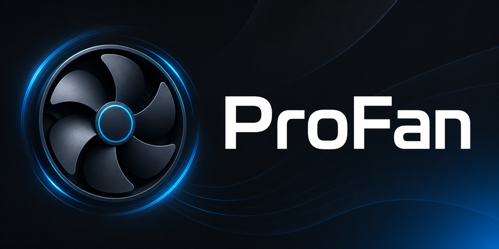
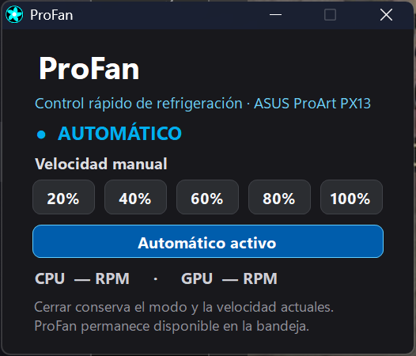
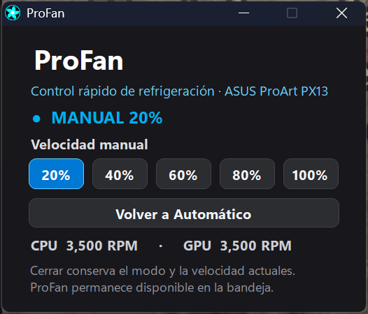
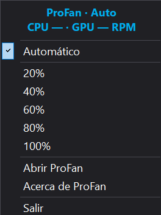

# ProFan

<p align="center">
  
</p>

ProFan is a Windows fan-control utility for the **ASUS ProArt PX13 HN7306**. It offers a dark Fluent-style interface, quick 20–100% presets, safe return to ASUS Automatic control, and an animated notification-area icon with live status.

> [!WARNING]
> Hardware fan control carries risk. ProFan is tested only on the ASUS ProArt PX13 HN7306. Keep the BIOS, ASUS System Control Interface, and thermal protections enabled. Use at your own risk.

## Features

- Spanish and English, selected during installation.
- Fluent-inspired dark UI with an independent action-blue identity.
- Manual presets: 20%, 40%, 60%, 80%, and 100%.
- One-click return to the previous automatic ASUS firmware profile.
- Animated fan icon in the Windows notification area.
- Two-line tooltip and menu header showing mode, CPU RPM, and GPU RPM.
- Closing the window keeps the current mode active in the notification area.
- Optional minimized startup, configurable from the notification-area menu.
- Automatic GitHub update checks with notification-area alerts and a manual check action.
- Automatic restore when suspending, signing out, or exiting ProFan completely.
- Spanish/English Inno Setup installer, Start menu shortcut, desktop shortcut, and uninstaller.

## Preview

| Automatic on startup | Manual preset |
|---|---|
|  |  |

<p align="center">
  <strong>Notification-area quick controls</strong><br>
  
</p>

## Install

1. Download `ProFan-Setup.exe` from [Releases](https://github.com/ezenwa/ProFan/releases/latest).
2. Choose English or Español.
3. Complete the installer and accept the Windows administrator prompt when launching ProFan.
4. If Windows hides the icon, move ProFan from the notification-area overflow into the visible area.

## Build locally

Requirements:

- Windows 11 x64.
- .NET Framework C# compiler included with Windows.
- [Inno Setup 6](https://jrsoftware.org/isinfo.php).

Run:

```powershell
.\Build.ps1
```

Outputs:

- `build\ProFan.exe`
- `dist\ProFan-Setup.exe`

## Safety model

Manual mode submits a constant fan curve to ASUS firmware and keeps it active without repeatedly switching the ASUS performance profile. Automatic restores the profile that was active before manual control. The 20% minimum prevents ProFan from intentionally requesting an unsafe zero-speed manual state. See [docs/SAFETY.md](docs/SAFETY.md).

## Documentation

- [Installation and usage](docs/INSTALLATION.md)
- [Architecture](docs/ARCHITECTURE.md)
- [Safety](docs/SAFETY.md)
- [Contributing](CONTRIBUTING.md)
- [Security policy](SECURITY.md)
- [Release process](docs/RELEASING.md)

## Español

ProFan es una utilidad bilingüe para Windows creada por **Joshua Ezenwa** y probada en la **ASUS ProArt PX13 HN7306**. Incluye botones de 20–100%, retorno inmediato al control Automático de ASUS, interfaz Fluent oscura, inicio minimizado opcional, comprobación de actualizaciones en GitHub e icono animado con RPM en el área de notificación. Al abrir la interfaz desde la bandeja, se restaura centrada en el monitor activo.

Consulta la [guía de instalación y uso](docs/INSTALLATION.md) y la [guía de seguridad](docs/SAFETY.md) antes de utilizarla.

## License and attribution

ProFan is licensed under **GPL-3.0**. Its ASUS ACPI interface was adapted from [G-Helper](https://github.com/seerge/g-helper), also GPL-3.0. See [NOTICE.md](NOTICE.md) and [LICENSE](LICENSE).

ProFan is independent and is not affiliated with, sponsored by, or endorsed by ASUS or GoPro, Inc. ASUS, ProArt, GoPro, and other names belong to their respective owners. No GoPro logo or official brand asset is included.
